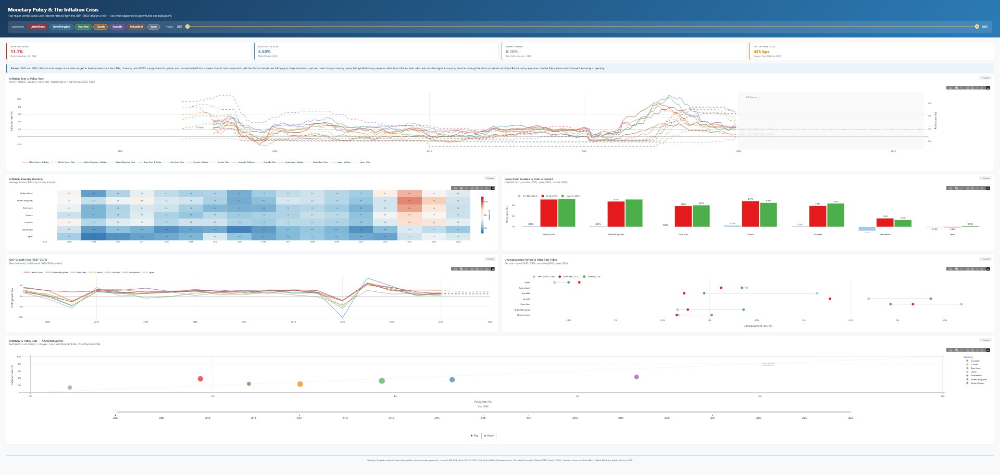
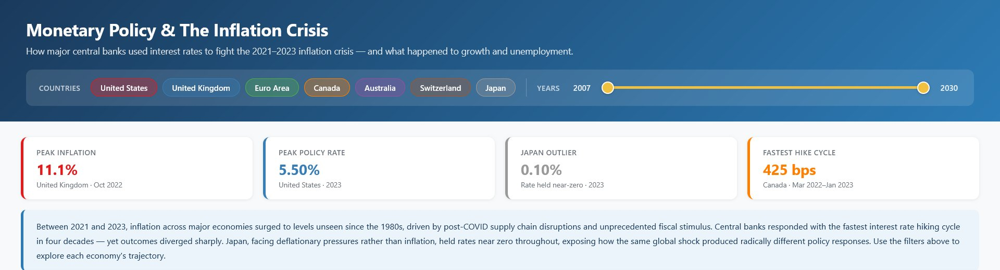
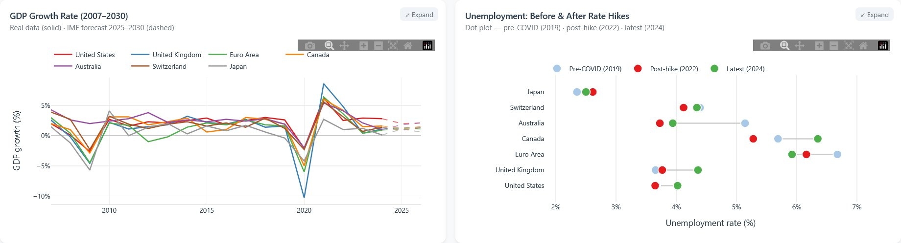
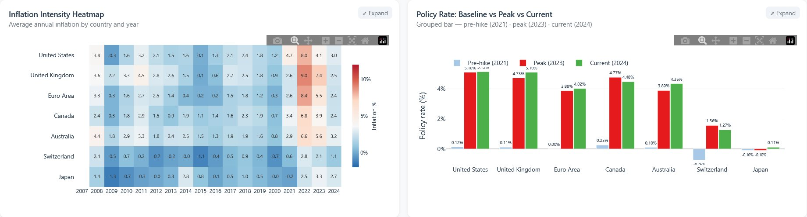
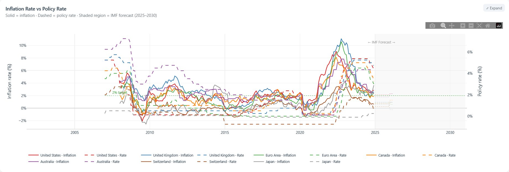
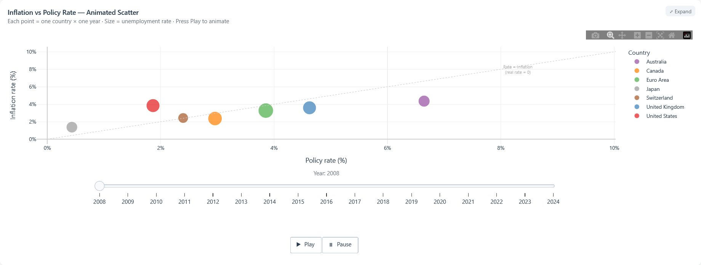

# Monetary Policy Response to the 2021–2023 Inflation Crisis

An interactive dashboard analysing how seven major economies responded to the post-pandemic inflation surge through monetary policy adjustments. Built as part of the CMT218 Data Visualisation module at Cardiff University (MSc Data Science).

## Dashboard Preview



## Overview

The dashboard tracks policy rates, inflation, unemployment, and GDP growth across the **United States, United Kingdom, Euro Area, Canada, Australia, Switzerland, and Japan** from 2007 to 2030 (including IMF forecast data). It visualises the relationship between central bank rate decisions and macroeconomic outcomes during the most significant inflationary episode in decades.

### Key Findings

- **UK peaked at 11.1% inflation** (Oct 2022) — the highest among all seven economies
- **US hit 5.50% policy rate** (2023) — the most aggressive tightening cycle
- **Japan held at 0.10%** throughout — a stark outlier driven by deflationary pressures
- **Canada's 425 bps hike** (Mar 2022–Jan 2023) was the fastest hiking cycle

## Features



**Interactive Controls** — Country toggle filters and dual-handle year range slider to explore specific economies and time periods.



**Dual-Axis Line Chart** — Inflation (solid) vs policy rate (dashed) trajectories with IMF forecast shading and key event annotations (GFC, COVID, inflation peak, rate cuts).



**Inflation Intensity Heatmap** — Cross-country inflation intensity over time with a diverging colour scale centred at the 2% target. **Grouped Bar Chart** — Pre-hike (2021), peak (2023), and current (2024) policy rate comparison.



**GDP Growth Line Chart** — Real data with IMF forecast horizon (dashed). **Unemployment Lollipop Plot** — Before-and-after comparison across three snapshots (pre-COVID, post-hike, latest).



**Animated Scatter Plot** — Dynamic bubble chart with Play/Pause controls. Each bubble represents one country in one year, with size mapped to unemployment rate and a 45° reference line marking zero real rates.

## Quick Start

### Prerequisites

- Python 3.9+
- pip

### Installation

```bash
git clone https://github.com/pedramebd/monetary-policy-dashboard.git
cd monetary-policy-dashboard
pip install -r requirements.txt
```

### Run the Dashboard

```bash
python app.py
```

Then open [http://localhost:8050](http://localhost:8050) in your browser.

### Static Version (No Python Needed)

To view the dashboard without any setup, open `dashboard.html` directly in any modern browser.

## Project Structure

```
monetary-policy-dashboard/
├── app.py                   # Dash application (entry point)
├── Dataviz_Project.ipynb    # Data cleaning, merging, and chart development
├── dashboard.html           # Self-contained exported HTML dashboard
├── requirements.txt         # Python dependencies
├── data/
│   ├── raw/                 # Original source files (unmodified)
│   │   ├── policy_rates.xlsx
│   │   ├── consumer_prices.xlsx
│   │   ├── unemployment-rate.csv
│   │   └── gdp_growth.xls
│   └── processed/
│       └── dashboard_data.csv   # Merged dataset (1,617 rows × 7 columns)
├── assets/                  # Dashboard screenshots
├── .gitignore
├── LICENSE
└── README.md
```

## Data Sources

| Dataset | Source | Format |
|---|---|---|
| Policy interest rates | [Bank for International Settlements (BIS)](https://data.bis.org/topics/CBPOL/data?pdqId=BIS%2CPDQ_L1%2C1.0&data_view=table&filter=FREQ%3DM%255ELAST_N_PERIODS%3D10&rows=REF_AREA&cols=TIME_PERIOD&settings=asc%7Cdesc%7Cname) | `.xlsx` |
| Consumer price inflation | [Bank for International Settlements (BIS)](https://data.bis.org/topics/CPI/data?filter=YEAR%3D2026%257C2022%257C2018%257C2014%257C2010%257C2025%257C2021%257C2017%257C2013%257C2009%257C2008%257C2012%257C2007%257C2011%257C2015%257C2016%257C2020%257C2019%257C2023%257C2024%255EFREQ%3DM%255EREF_AREA_TXT%3DChina%257CEuro%2520area%257CJapan%257CSwitzerland%257CUnited%2520Kingdom%257CUnited%2520States%257CAustralia) | `.xlsx` |
| Unemployment rate | [Our World in Data](https://ourworldindata.org/grapher/unemployment-rate) | `.csv` |
| GDP growth (incl. forecasts) | [IMF World Economic Outlook](https://www.imf.org/external/datamapper/NGDP_RPCH@WEO/OEMDC/ADVEC/WEOWORLD) | `.xls` |

Coverage: 7 economies, 2007–2030 (forecast years from IMF WEO).

## Tech Stack

- **Python 3.9+**
- **Dash 4** — Web application framework
- **Plotly** — Interactive charting library
- **dash-bootstrap-components** — Layout and theming (FLATLY theme)
- **Pandas** — Data wrangling and merging
- **xlrd / openpyxl** — Excel file parsing

## Methodology

The Jupyter notebook documents the full pipeline:

1. **Ingestion** — Loading four heterogeneous source files (CSV, XLS, XLSX)
2. **Cleaning** — Standardising country names, date formats, and column schemas across sources
3. **Merging** — Joining on country–year keys into a single tidy dataset (1,617 rows)
4. **Visualisation** — Building six chart types with Plotly, iterating on design choices informed by visualisation research (Cleveland & McGill, Tufte, Munzner, Ware, Cairo)
5. **Deployment** — Wrapping charts in a Dash 4 application with interactive controls and exporting a standalone HTML version

## License

This project is released under the [MIT License](LICENSE).

## Author

**Pedram Ebadollahyvahed** — MSc Data Science, Cardiff University (2025–2026)

[GitHub](https://github.com/pedramebd) · [LinkedIn](https://www.linkedin.com/in/pedramebadollahyvahed)
